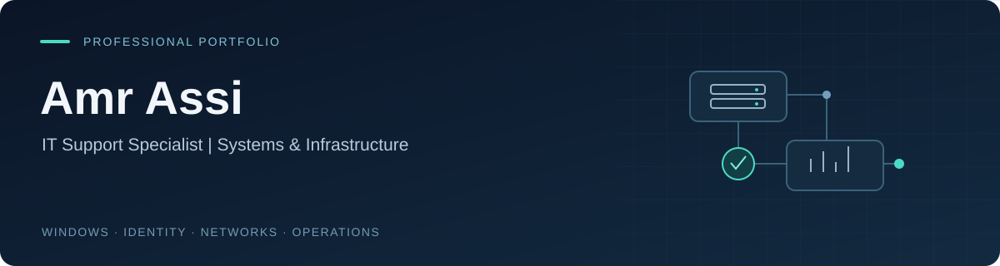
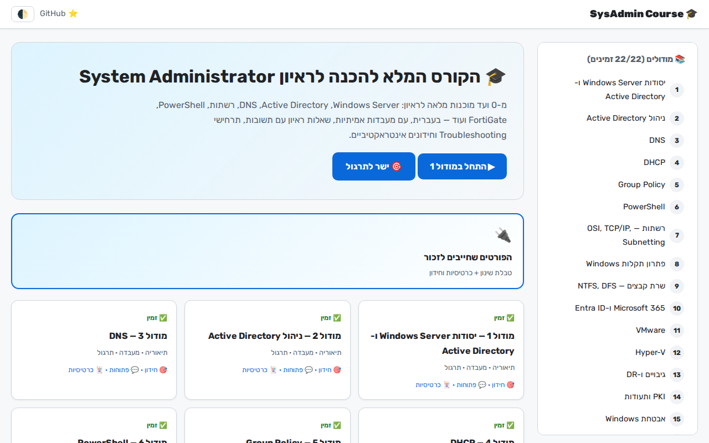
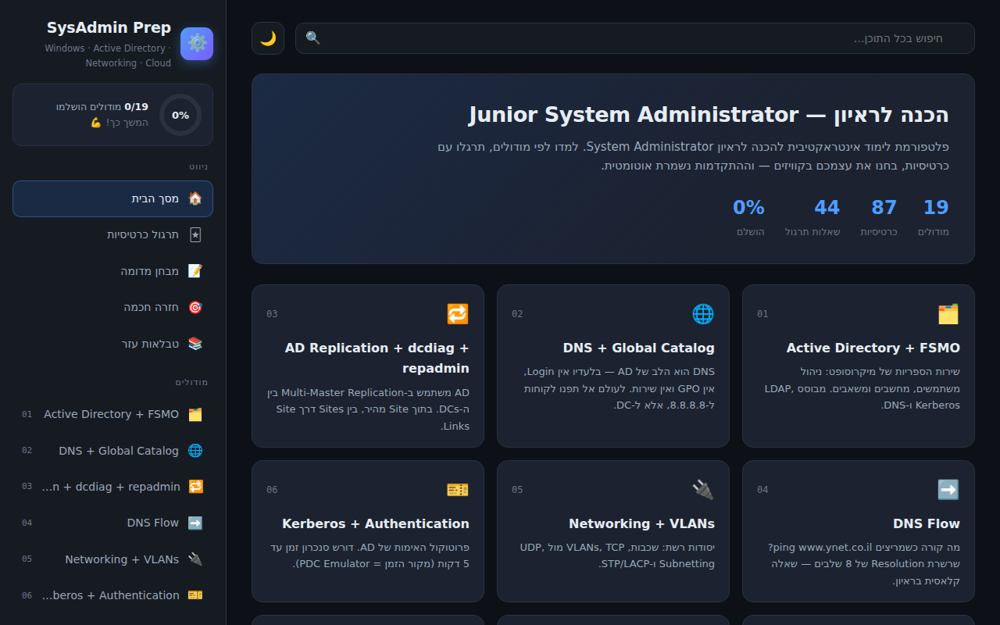

[Portfolio](https://amr-assi-portfolio.pages.dev/) · [LinkedIn](https://www.linkedin.com/in/amr-assi-b13451232/) · [Email](mailto:amr.assi999@gmail.com)

I work with Windows infrastructure, Microsoft 365, identity services, VMware, monitoring, and file recovery in multi-client IT environments. I am developing toward a **System Administrator** role through hands-on operations, an enterprise-style home lab, and practical PowerShell projects.

## Systems work

| Project | What it demonstrates |
| --- | --- |
| **[Enterprise Home Lab](https://github.com/AmrAssi/Amr-Assi-Portfolio/tree/main/labs/enterprise-home-lab)** | AD DS, DNS, DHCP, Group Policy, network segmentation, two-tier PKI, IIS, hybrid device management, and backup workflows. |
| **[Administration Scripts](https://github.com/AmrAssi/Amr-Assi-Portfolio/tree/main/tools/admin-scripts)** | RDS session shadowing, AD onboarding from a template, and profile-disk investigation. Public adaptations with fictional examples and isolated tests. |
| **[Windows Server Health Report](https://github.com/AmrAssi/Amr-Assi-Portfolio/tree/main/tools/server-health-report)** | Read-only PowerShell collection, useful thresholds, clear failure states, HTML/JSON reports, and passing Windows checks. |
| **[Troubleshooting & Recovery](https://github.com/AmrAssi/Amr-Assi-Portfolio#operations-and-recovery)** | A real Zerto file-recovery case and repeatable lab procedures for GPO, DNS, and recovery verification. |

## Hands-on responsibilities

| Area | Practical work |
| --- | --- |
| **Windows & identity** | Active Directory, GPO, file permissions, Entra ID, and Intune. |
| **Virtualization** | vCenter/ESXi operations, resource checks, terminal-server cloning, vMotion for host maintenance, and approved RAM/storage expansion. |
| **Microsoft 365 & security** | Exchange, SharePoint, email filtering, Microsoft Defender policies, and endpoint-security operations. |
| **Recovery & monitoring** | File recovery with Veeam, Zerto, and Shadow Copies; infrastructure monitoring with Zabbix. |
| **Endpoint deployment** | Personally prepared **300+ computers for 150 branches**: imaging, domain join, applications, network settings, peripherals, and final checks. |

**At Matrix:** Computer & Systems Technician, January 2024–July 2025 → internal promotion to IT Support Specialist, July 2025–present.

## Systems learning projects

<table>
<tr>
<td width="50%">

<h3><a href="https://github.com/AmrAssi/system">SysAdmin Learning Lab</a></h3>
22 modules covering Windows, identity, networking, virtualization, recovery, and troubleshooting. Hebrew RTL, diagrams, quizzes, and study progress.
</td>
<td width="50%">

<h3><a href="https://github.com/AmrAssi/sysadmin-prep">SysAdmin Prep</a></h3>
Flashcards, practice questions, mock exams, and targeted review with progress stored in the browser.
</td>
</tr>
</table>

These are learning resources. Professional experience and completed lab validation are documented separately.

## Additional projects

| Repository | Focus |
| --- | --- |
| [AnonMAC](https://github.com/AmrAssi/AnonMAC) | Python and Linux network-interface configuration. |
| [WebPathScraper](https://github.com/AmrAssi/WebPathScraper) | Python, HTTP requests, HTML parsing, and downloads. |
| [Course Catalog](https://github.com/AmrAssi/my-react-project) | Earlier React/Firebase web application prototype. |
| [Movie App](https://github.com/AmrAssi/react-native) | Earlier React Native/Expo client and Express/MongoDB backend prototype. |
| [React Workspace](https://github.com/AmrAssi/react) | Learning workspace; no application source currently present. |

**Languages:** Arabic — Native · Hebrew — Fluent · English — Advanced

Architecture diagrams describe the lab. Screenshots show the actual learning applications. Test claims link to recorded results.
